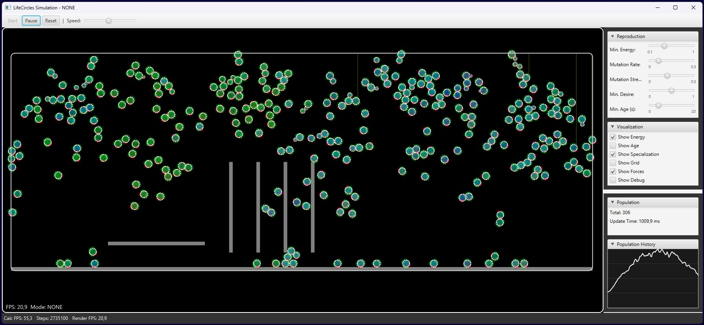
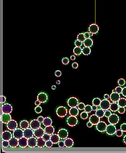
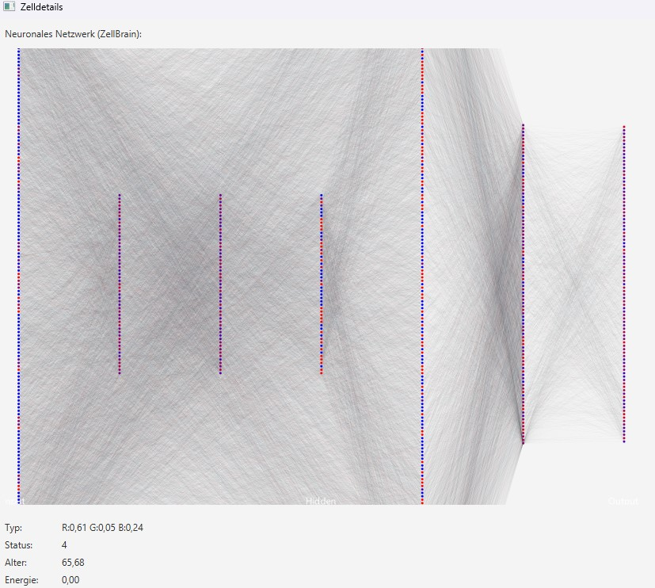

# LifeCircles

Es soll eine 2D Simulation von biologischen Entwicklungen in Java geschrieben werden.
Die Java Anwendung soll mit Maven gebaut werden.

Die Anforderungen an die Simulation sind die folgenden:

Simulation
* Umgebung
  * Viskose Umgebung (ähnlich Wasser, kann aber auch als Reibung auf dem Hintergrund abgebildet werden).
  * Gravitation.
  * Endlose Umgebung (was aus der Simulations-Area auf einer Seite raus geht, kommt auf der gegenüberligenden Seite wieder herein)
* Zellen
  * Zellen werden als Kreise abgebildet.
  * Zellen können frei rotieren und bewegt werden.
  * Zellen sollen sich möglichst nicht überschneiden. Deshalb wirken Zellen auf andere Zellen eine abstoßende Kraft, wenn sich ihre Kreiskörper überscheiden. Diese Kraft wird umso stärker, je näher sich ihre Zentren kommen.
  * Auf der Oberfläche der Kreise sitzen Sensor- /Aktor-Punkte. 
    * Die Aktoren werden bei Drehungen der Zelle mit rotiert.
	* Die Aktoren haben verschiedene Typen (Farben).
	* Als Sensor können sie andere Aktoren anderer Zellen innerhalb eines begrenzen Radius wahrnehmen.
	* Als Aktoren können sie, eines begrenzen Radius, eine anziehende oder abstoßende Kraft auf die Aktoren der anderen Zellen bewirken (wie ein Feld).
	* Ein Aktor eines bestimmten Typs sendet immer ein bestimmtes Feld aus. Wie dieses Feld auf Aktoren anderes Typs wirkt, ist global in der Simulation festgelegt.
    * Die Anzahl der Aktoren ist Fix und wird erst einmal auf 12 fest gelegt die gleichmäsig über die Oberfläche verteilt sind.
  * Eine Zelle hat einen Typ (Farbe) der von anderen zellen in der Umgebung wahrgenommen werden kann.
  * Eine Zelle hat eine Größe. Diese kann si innerhalb eines betimmten Bereiches aktiv vergrößern oder verkleinern.
  * Eine Zelle kann sich nicht aktiv bewegen oder rotieren, dies geschieht nur durch die Interaktion mit anderen Zellen und den Kraftfeldern die auf sie einwirken.
* Erbinformation
  * Die Erbinformation ist als neuronales Netz mit Synapsen und neuronen abgelegt.
    Sie bestimmt das Verhalten der Zelle über ihre Inputs und Outputs.
  * Inputs
    * Sensoren (Typ des eigenen Aktors, Feld-Typ fremder Aktoren (kann eine Mischung sein), Kraft auf den Sensor (anziehend oder abstoßend))
	* Typ der eigenen Zelle
	* Typ der Zellen in der Umgebung (kann eine Mischung sein)
  * Outputs
    * Größe der Zelle
	* Aktoren (Typ des eigenen Aktors, Kraft auf den Sensor).
* Typen
  * Ein Typ ist eine Mischung aus drei Zahlen-Werten (R, G, B).
    Er wird zur Kennzeichnung verwendet und kann als Input- oder Output durch drei Werte repräsentiert werden.
* There is no ground the cells can life on.
  We need something on the bottom that blocks Cells.
  Make it generic, so we can use this type of Blocker to generate later more complex environments.

View:
* Zoom und Pan.

Das System-Design der Anwendung soll enthalten:
* CalculationService der die Berechnungen in einem eigenen Thread ausführt.
* SimulationView das die Darstellung in einem eigenen Thread und einer von dem Berechungen unabhängigen Framerate darstellen kann (Datenaustausch über ein Dto-Objekt).

# TODO

* ConstantBrain das konstante Ausgänge hat.
  * Testszenario für Zellabstoßung.
  * Testszenario für AktorSensor anziehend und abstoßend.

* Sexuelle Vermehrung.
  * Es müssen zwei Zellen verschiedenen Geschlechts zusammen kommen und beide signalisieren, dass sie sich teilen wollen.
  * Es wird ein Crossover der Netzte gemacht (siehe NeuralNetworkTest).
  * Das geschlecht wird nur als interne Eigenschaft abgelegt und nicht als Outut nach außen getragen. 
    Sie müssen sich also Anhand anderer Merkmale erkennen.

* Jede Zelle hat ein Rechenzeit für ihr CellBrain. 
  * Wenn sie länger braucht, da sie mehr Synapsen und Neuronen hat, werden die Berechnungen weniger oft ausgeführt.
  * Alternativ kann sie auch mehr Energie verbrauchen.
  * Oder anderer Ansatz, sie kann entscheiden, wie viel Energie sie für die Berechnungen verbraucht (wie oft diese ausgeführt werden).  
    Wenn zu wenig Energie da ist, kann sie keine Berechnungen mehr durchführen.  
    Dafür braucht es aber wieder ein kleines Master-Brain, das diese Entscheidung fällt.  
    Dieses Master Brain könnte dann auch, wie usprünglich geplant, die Entscheidung treffen, wann welche Cell-Status-Lqyer aktiv werden.

* Füge im SimulationState einen Timestamp hinzu und
  verwende diesen, um nur dann ein neues DTO-Objekt zu erzeugen, wenn sich die Simulation wirklich geändert hat.

* Berechnungen des CellBrain nur alle n-Steps.
  * Small Manager-Brain als Steuerung wie oft Sub-Brains for special-Tasks are updated.
  * Neu Neuron-Type/ or Input for time depending things (level up a Number and reset if a Value is reached).

* Age als Kurve und Input.

* Unterschiedliche Viscosity in der Umgebung und als Input für die Sensor-Interaktionen.

* Energieübertragung als Input spüren.
  * Im Sensor ablegen, so das die Zelle spührt, von welcher Stelle die Energie herkam.
  * Energie von SunRay.
  * Energie von anderer Zelle.

* Die Zelle soll mit ihren Sensoren den Kontakt mit Blockern spüren. Vielleicht die Oberfläche mit etwas entsprechenden wie den Aktoren der Zellen ausstatten?

# DONE

* Prüfe den Grid-Paritionierungs-Algorithmus und die Berechnung der Interaktionen.
  * Die Größe der Grid-Zellen sollte der maximal Zell-Radius + der maximale Focre-Field-Radius sein.
  * Um die Effizienz des SpatialGrid-Algorithmus zu verbessern, werde ich die Map-basierte Implementierung durch eine 2D-Array-basierte Struktur ersetzen. Dies ermöglicht schnelleren Zugriff auf benachbarte Zellen.
  * SpatialGrid: Ersetze die Map-basierte Speicherung durch ein 2D-Array und passe die Methoden entsprechend an.

* Eine Zelle soll bei der Teilung entscheiden können, wie viel % Energie sie der Child-Zelle mitgibt.
  Dazu wird pro Actor ein neuer Output benötigt.  
  So kann sie versuchen Strukturen um sich herum aufzubauen, ohne selbst zu viel darunter zu leiden.

* Cell#readObject sieht sehr falsch aus

* Die Sensoren sollen spüren, wenn sie einen Blocker berühren.
  * Es soll kein neuer Sensor-Input hinzugefügt werden,
    sondern als Cell-Typ (0.5, 0.5, 0.5) und als Actor-Typ (0.5, 0.5, 0.5) gesetzt werden.
    Alle anderen Sensor-Inputs sollen auf 0 gesetzt werden.

* Die Initalisierung des NeuralNetwork im CellBrain fügt alle Verbindungen als Synapsen hinzu.
  * Füge einen Parameter hinzu der festlegt ob alle Synapsen angelegt werden sollen oder nur ein Prozentualer Teile zufällig.

* Wenn bei einer Mutation ein neuer Layer hinzugefügt wird, werden die bestehdenen Synapsen entfernt.
  Diese sollen bestehen bleiben und nur die neuen Synapsen werden hinzugefügt.
  Wie beim anlegen eines Neuen Netzes sollen nicht alle Synapsen angelegt werden, sondern nur ein prozentualer Teil.

* Ich will eine Zelle anklicken können um sie zu Untersuchen und zu beobachten.
  * Es soll ein Fenster angezeigt werden in dem ich eine visualisierung des ZellBrain mit den Aktivierungen des Neuronalen-Netzes sehe.
  * Die Zelle soll nicht als Dto übertragen werden sondern als Referenz auf die Zelle um eine effiziente Anzeige sicher zu stellen.
  * Der Typ, State, age, energy und generation sollen ebenfalls angezeigt werden.
  * 

* Zeige, statt des "Specialization-Indicator", den Zell-State in der Mitte der Zelle als nicht transparente Zahl (0-7) in der Farbe des Zell-Typs an.

* Baue einen neuen Zell-Zustand ein, der bei der Teilung einer Zelle gesetzt wird.
  * Dieser Zell-Zustand ändert sich wärend der Lebenszeit einer Zelle nicht mehr.
  * Der Zell-Zustand bestimmt, welche zusätzlichen Hidden-Layer in einer Zelle aktiv sind.
    Die inaktiven Layer werden bei der Aktivierung des CellBrain nicht ausgeführt und
    fließen auch nicht in die Berechnung den Energie Verbrauchs ein.
  * Es gibt immer "normale" Hidden-Layer die immer aktiv sind.
  * Der Zustand der Kind-Zelle wird über drei globale Ausgänge gesteuert.
    Diese steuern welcher Layer (0 bis 7) oder welche Kombination von Layern (0 bis 2) zusätzlich aktiv sind.
    (Flag einbauen um die zwei verschiedenen Implementierungen testen zu können.)
  * So sollen Zellen mit verschiedenem Verhalten aus dem gleichen Zelltyp hervorgehen können,
    die alle Erbinformationen des Zelltyps tragen und weiter geben.
  * Der Zell-Zustand soll wie der zell-Typ auch nach außen durch Sensoren anderer Zellen sichbar sein
    und von der Zelle selbst als Globaler-Input wahrgenommen werden.
  * Erstelle eine neue Klasse "Layer" mit der Neuronen-List und setze das Flag "isActiveLayer" in diesem Objekten.

* Make de.lifecircles.model.Cell.updateWithNeighbors static and move it to CellCalcService.

* Baue einen Tag-/ Nacht-Zyklus ein, der die Anzahl der Sonnenstrahlen und die Energie-Absorption der Zellen beeinflusst.
  * Füge eine Konstante in der SimulationConfig ein, die definiert, wie lange ein Tag/Nacht-Zyklus dauert.
  * Füge eine Konstante in der SimulationConfig ein, die definiert, wie viele Sonnenstrahlen pro Tag/Nacht-Zyklus erzeugt werden.
  * Die Intensität soll einer Sinus-Funktion folgen (Mittags volle Intensität, Nachts keine Intensität).

* Verschiebe die Schalter für "Grid", "Forces", "Debug" als Checkboxen in das "Visualization" Panel.

* Die PartitioningStrategy sollte mit einer Grid-Size von Sell-Radius + Field-Radius aufgerufen werden, um alle Nachbarn die Kräfte übertragen können zu finden.

* Eine geteile Zelle soll mit der minSize starten und wärend eines kurzen Wachstumsprozesses (2 s)  auf ihre normale, von GlobalOutputFeature.SIZE vorgegebene, Größe wachsen.
  * Füge eine Konstante in der SimulationConfig ein, die definiert, wie lange eine Zelle braucht, um auf ihre normale Größe zu wachsen.

* Eine geteilte Zelle soll mit der Rotationsrichtung der Mutter-Zelle starten.
* 
* Bisher hat der Output GlobalOutputFeature.REPRODUCTION_DESIRE entschieden, wann sich eine Zelle teilen will.
  * Verschiebe diesen nach ActorOutputFeature und dieser neue Output entscheidet in welche Richtung sich die Zelle teilen will.
    Also nicht mehr in eine zufällige Richtung, sondern in der Richtung des Actors der Zelle die sich teilt.

* Nachdem sich eine Zelle geteilt hat, soll für das Child (CellBrain) auf jeden Fall ein think durchgeführt werden um sicher zu stellen, dass die Outputs gesetzt sind.

* Füge bei der aktivierung der Output-Neuronen ein Flag hinzu und berechne für Outputs keine Aktivierungsfunktion.

* Stelle die Berechnung des SimulationState DTO-Objektes so um, dass es vom View nach 30 FPS asynchron angefordert wird und 
  nicht nach jedem Calc-Step erzeugt wird.
  Stelle die Funktion getLatestState() so um, dass der SimulationState nur angelegt wird, wenn er vom View angefordert wird.

* Füge eine Konstante in der SimulationConfig ein die definiert, nach wie vielen Steps eine Zelle stirbt.
  * Füge an dieser Stelle eine Funktion hinzu, die die Zellen entfernt, die nicht mehr aktiv sind.

* Prüfe, ob die Anziehende Kraft zwischen Actor und Sensor auch abtoßend wirken kann.
  So war das eigentlich ursprünglich gedacht, wenn diese einen negativen Wert hat.
  Wenn sie noch nicht abstoßend wirken kann, implementier dies so.

* Eine Zelle soll aktiv Energie über einen Actor vom Nachbar-Sensor absaugen können (Räuber).
  Füge einen neuen SensorInputFeature für das Energie-Absaugen hinzu und verwende diesen als Input für das CellBrain.
  Wenn also ein Sensor einen Aktor einer anderen Zelle spürt, soll er, wenn der entsprechende Output dies signalisiert, die Energie der Zelle absaugen.

* Eine Zelle soll einen Input für ihren eigenen Celltype bekommen, so dass sie diesen mit dem der Nachbarzellen vergleichen kann.

* Eine Zelle soll fühlen, wenn ein SunRay auf sie trifft.

* Der Energieaustausch zwischen Zellen soll über die Sensoren und Aktoren erfolgen und nicht über Rays.
  Wenn also ein Sensor einen Aktor einer anderen Zelle spürt, soll er, wenn der entsprechende Output dies signalisiert, die Energie der Zelle abgeben.

* Eine Cell soll fühlen können, welcher Sensor oben ist.

* Prüfe nochmals, ob die aktuell verwendete SpatialGridPartitioningStrategy die Partitionierung richtig im Zusammenhang mit der maximalen Zellgröße verwendet.

* CellBrain.findFirstSensedCell und CellBrain.findFirstSensedActor sollen die sensedActor sensedCell temporär Variablen des SensorActors verwenden.
  Prüfe nochmals, ob diese auch korrekt an der richtigen Stelle gesetzt werden.

* Füge zu der Zelle einen internen GenerationCounter hinzu um im Training ermitteln zu können, in welcher Generation eine Zelle ist.
  * Erhöhe den Counter beim Child, wenn sich eine Zelle teilt.

* Füge für die Inputs des CellBrain die nicht von Sensor abhängen ebenfalls einen Enum ein und verwende den ordinal für den Zugriff auf den Input.

* Füge zum Cellbrain einen Input pro eigenen Sensor für den ActorType des Sensed-Actors hinzu.

* Füge zum Cellbrain einen Input für die eigene ForceStrength pro Actor hinzu.

* Berechne die Temporären Positionen der SensorAktor Punkte nur einmal in einem Step, nachdem die Positionen der Zellen berechnet wurden.
  Lege diese in dem SensorAktor ab und verwende diese für die weiteren Berechnungen, so das die Positionen nicht immer neu berechnet werden müssen.

* Füge im CellBrain dem jeweiligen Sensor-Input zusätzlich den Typ des eigenen Aktors hinzu sowie dessen Ausgabe Stärke.

* Lege in jedem SensorActor eine temporäre Variable "sensedActor" hinzu, die wir für weiter Zugriffe auf den wahrgenommenen Aktor und dessen Zelle verwenden.
  Wir gehen davon aus, dass ein Sensor physikalisch nicht mehr als einen Aktor und seine Nachbarzelle wahrnehmen kann.
  Erweitere den SensorActor um eine Referenz auf dessen Zelle, so das wir einfach auf deren internas zugreifen können.

* Füge im CellBrain dem jeweiligen Sensor-Input zusätzlich, zum Typ des Aktors, den Typ der Zelle hinzu den der Sensor gerade wahrnimmt.

* Füge einen Training-Modus "HighPosition" hinzu.
  * Orientiere Dich an der HighEnergyTrainStrategy.
  * Die Simulation starten mit 60 Zellen.
  * Es wir nur der übliche Boden-Blocker hinzugefügt.
  * Nach 3000 Steps werden die 20% Zellen mit dem höchsten Höhe über dem Boden als Gewinner ausgewählt.
  * Die Zellen werden mutiert und die Simulation wird im Training-Modus fortgesetzt.
  * launch.json: java -jar target/LifeCircles.jar --trainMode=HIGH_POSITION

* Berechne den Partitionierungs-Algorithmus für die Berechnung der Interaktionen nur einmal in einem Step, nachdem die Positionen der Zellen berechnet wurden.
  Übergebe ihn allen Funktionen die ihn benötigen als Argument.

* Die Anwendung solle einen Train-Modus bekommen in der wir den zellen spezielle verhalten antrainieren können.
  * In dem Modus sollen eigene Umgebungen mit dem Blocker verwendet werden. Die Blocker werden je nach Modus gezielt plaziert.
  * In dem Modus wird eine bestimmte Anzahl Zellen gezielt hinzugefügt und positioniert.
  * Der Modus hat eine eigene Logik in der jeweils nach n Steps die Gewinner ausgewählt, werden. Kinder von ihnen angelegt werden und die Simulation wird fortgesetzt.
  * Es gibt also für jeden Modus eine Initialisierungs-, eine Selektions- und eine Mutations-Funktion.
  * Es soll vorgesehen werden, dass es mehrere Train-Modi gibt.
  * Der jeweilige Train-Modus wird der Anwendung über eine Enum-Variable angegeben und über ein Argument beim Start der Anwendung ausgewählt.
* Füge einen Training-Modus "HighEnergy" hinzu.
  * Die Simulation starten mit 20 Zellen.
  * Es wir nur der übliche Boden-Blocker hinzugefügt.
  * Nach 500 Steps wirden die 20% Zellen mit dem höchsten Energie-Level als Gewinner ausgewählt.
  * Die Zellen werden mutiert und die Simulation wird im Training-Modus fortgesetzt.
  * launch.json: java -jar target/LifeCircles.jar --trainMode=HIGH_ENERGY

* Add a new Input to the CellBrain that represents the energy of the cell. 

* Berücksichtige beim Energieverbrauch pro Rechenstep die Anzahl der Synapsen im neuronalen Netz.

50 Zellen, Calc FPS: 6,2
* Verteile Berechnungen auf mehrere Threads.
  * Untersuche die PartitioningStrategies bei der Berechnung von Interaktionen.
  * Überlege ob die Berechnung der neuronalen Netze auf mehrere Threads verteilt werden kann.

* Es scheint mir so, als ob bei den ActorSensors die Interaktionen nicht korrekt funktionieren. Es sieht so aus, als ob gerade unterschiedliche Farben für die anziehende Interaktion verwendet werden (Schwarz zieht weiß an, Rot zieht Blau an, etc.).
  Prüfe das und ändere es so, dass gleiche Farben aufeinander anziehen wirken und unterschiedliche Farben abstoßend.

* Fasse in der Anzeige der "Population History" immer die ähnlichsten 10% der Celltypes zusammen und stelle diese zusätzlich als Kurven dar.

* Die ausgesendete EnergieRays sollen auch nur bis zur maximalen größe der Zelle weit reichen. 
  Somit kann nach der Änderung auch für die Suche nach intersections der Partitioner verwendet werden, um Zellen zu finden die der Strahl treffen kann.

* Age
  * Cells have an age that is increased by 1 every frame.

* Simulation: Die Anzahl der SunRay die auf eine Fläche geht soll unabhängig von der Größe (Breite) der Simulation sein.
  Füge also pro Calculation-Step immer so viele SunRay in die Simulation ein, das z.B. im Schnitt alle 100 px ein SunRay auftrifft.

* If the last Cell dies, use this one und insert mutation of the last cell to create the new population.

* Mutation: Neue Hidden-Layer einfügen.
* Mutation: Neue Synapse im Hidden-Layer einfügen.
* Mutation: Neue Neuronen Hidden-Layer einfügen.
* Mutation: Neuronen in den Hidden-Layer entfernen.
* Mutation: Synapse in den Hidden-Layer entfernen.

* Lagere alle Funktionalität die mit der Berechnung der Zellen-Energie zu tun hat in einen "EnergyCellCalcService" aus.

* Lagere alle Funktionalität die mit der Berechnung der Zellen-Abstoßung zu tun hat in einen "RepulsionCellCalcService" aus.

* Lagere alle Funktionalität die mit der Berechnung der Zellen-Interaktion zu tun hat in einen "ActorSensorCellCalcService" aus.

* Simplify the ActorSensor rules. ActorSensor vom selben Typ (gleiche farben) ziehen sich an, 
  ActorSensor mit unterschiedlichen Typ stoßen sich ab. 
  Die Berechnung berücksichtigt alle drei Farben und berechnet einen Mittelwert aus allen Unterschieden der Farben.
* It looks like, the visualisation of the ActorSensor fields are not respect the radius used in calculation.
Check this and fix it, if this is true.
* Füge in dem Neuronalen Netz einen neuen Output hinzu der in der ReproductionManager.canReproduce() verwendet wird, um zu entscheiden, ob sich eine zelle teilen will. Beachte, das bei der Zellteilung die Energie der Mutter-Zelle auf beide aufgeteilt wird.
* View: zeichne einen weißen Rahmen mit abgerundeten Ecken um die Simulation-Area.
* View: zeichne einen hellgrauen Rahmen mit abgerundeten Ecken um den bereich der Simulation, in der die Zellen sich befinden können, so dass dieser beim Zoom und Pan mit verschoben wird.
* View: Beim Zoom soll die aktuelle Maus-Position als Mittelpunkt benutzt werden.

* Simulation: Wenn nur noch 10% der initialen Anzahl Zellen vorhanden ist, erzeuge neue Zellen als Mutation von zufällig ausgewählten Zellen. Ausch hierbei wird die Energie auf Mutter- und Kind-Zelle aufgeteilt.

* Simulation: Um die Geschwindigkeit zu verbessern, führe ein viruelles Raster von der maximalen Zellgröße ein. 
  Je nach position einer zelle wird diese in einer dieser Rasterzellen platziert.
  Bei der berechnung von Kräften müssen dann nur die Zellen in der eigene Rasterzelle und der jeweiligen acht Nachbar-Rasterzellen berücksichtigt werden.

* Simulation: Um Energie zwischen Zellen austauschen zu können, kann eine Zelle einen Energie-Strahl, entsprechen des SunRay in Richtung eines ihrer Sensor-Aktoren nach außen senden. 
  * Der Betrag der Energie ist immer 3% der Energie der Zelle.
    Ihre Energie wird dann auf jeden Fall um diesen Betrag reduziert.
  * Die Nachbarzelle die den Energie-Strahl schneidet erhöht ihre Energie um diesen Betrag. Wenn er keine Nachbarzelle trifft, ist die Energie verloren.
  * Füge im Neuronalen Netz einen neuen Output für jeden SensorActor hinzu, der beim überschreiten eines Schwellwertes einen solchen Strahl sendet vom Mittelpunkt der zelle in Richtung dieses SensorActors nach außen sendet.

* If all Cells are dead, create new population with random induviduums in the inial size.

* Lagere alle Funktionalität die mit der Berechnung der Sun-Energie zu tun hat in einen "EnergySunCalcService" aus.

* Energie
  * Cells have an energy.
  * Cells can absorb energy from the environment.
    * Sun-Energy Rays are emitted from the top of the environment on random Places in a specified rate. Rays are existing only for one calculation cycle.
    * If a Ray intersect a Cell, the Cell absorbe the energy an the cell's energy is increased. The Ray is intersected and removed.
    * If a Ray intersect a Blocker, the Ray is intersected and removed.
* Cells lost energy over time.
  * If the cell's energy is below a certain threshold, the cell will die.

* Lagere alle Funktionalität die mit der Berechnung der Blocker und der Interaktion mit Zellen zu tun hat in einen "BlockerCellCalcService" aus.
